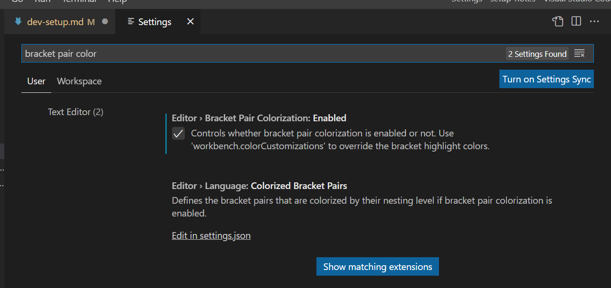
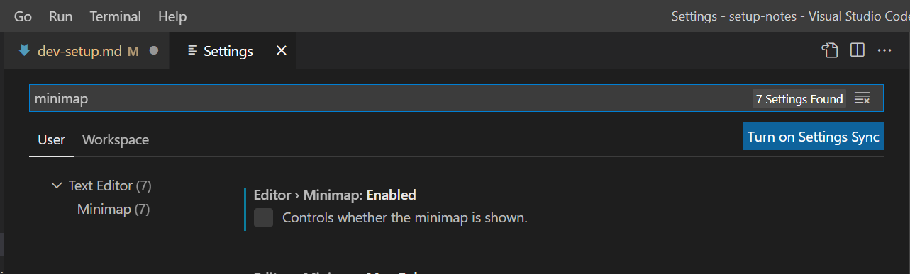
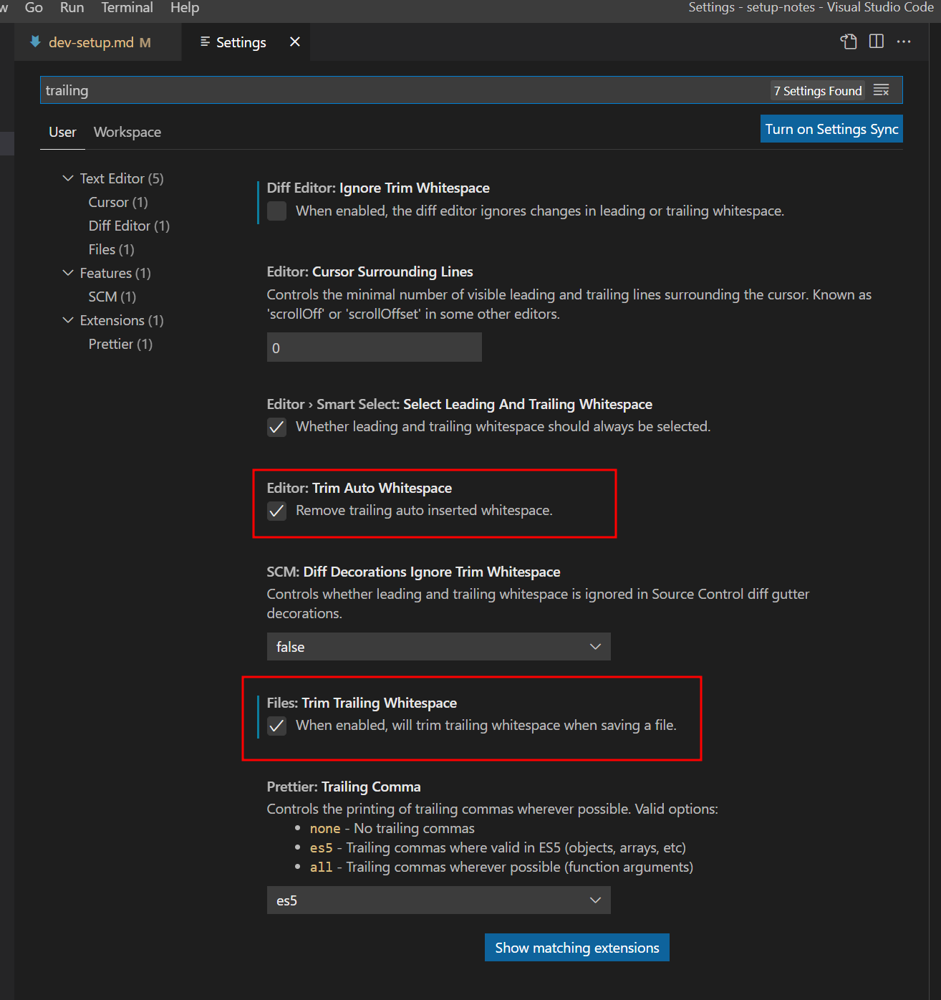
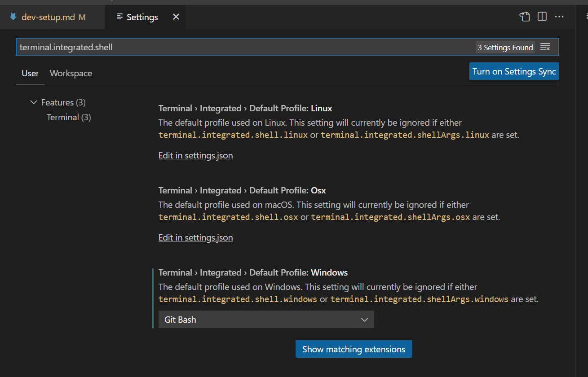

## Software
- [VS Code](https://code.visualstudio.com/download)
- [Git for Windows](https://git-scm.com/download/win)
- [GitHub Desktop](https://desktop.github.com/)
- [KDiff3](https://download.kde.org/stable/kdiff3/)
- [Nodepad2](https://www.flos-freeware.ch/notepad2.html)
- [Docker](https://docs.docker.com/desktop/windows/install/)
- [7Zip](https://www.7-zip.org/download.html) - for Windows 11 in order to run `Notepad2` same way as Windows 10, you would need to uninstall `Notepad` app from Windows Store first
- [Adobe Reader](https://get.adobe.com/reader/)
- [Flameshot](https://flameshot.org/) - Screenshot tools
- [FireFox](https://www.mozilla.org/en-US/firefox/new/)
- [Azure Data Studio](https://learn.microsoft.com/en-us/sql/azure-data-studio/download-azure-data-studio?view=sql-server-ver16&tabs=redhat-install%2Credhat-uninstall#download-azure-data-studio)
- [Postgresql](https://www.enterprisedb.com/downloads/postgres-postgresql-downloads) you can install the client `psql` by selecting the client tools
- [Core Temp](https://www.alcpu.com/CoreTemp/) CPU Temperature
- [Java JDK](https://www.oracle.com/hk/java/technologies/downloads/)

## Coding related
- [nodejs](https://nodejs.org/en/)

## VS Code Extension
- GitHub Copilot
- Import Cost
- Prettier
- GitLens
- ESLint

## Configuration
- `File` -> `Preferences` -> `Settings` or `Ctrl + ,`
- **bracket-pair-colorizer** - is a native feature on VSCode now

- Disable **minimap**

- **Remove Trailing Whitespace**

- Set `bash` as default terminal

## Troubleshooting
- environment could be different from `cmd`, `PowerShell`, `bash`
- can add enviroment variable to bash by `export JAVA_HOME="C:\Program Files\OpenJDK\openjdk-8u312-b07"`
- `JAVA_HOME` should be the main installed directory rather than the bin folder of the JAVA.exe
